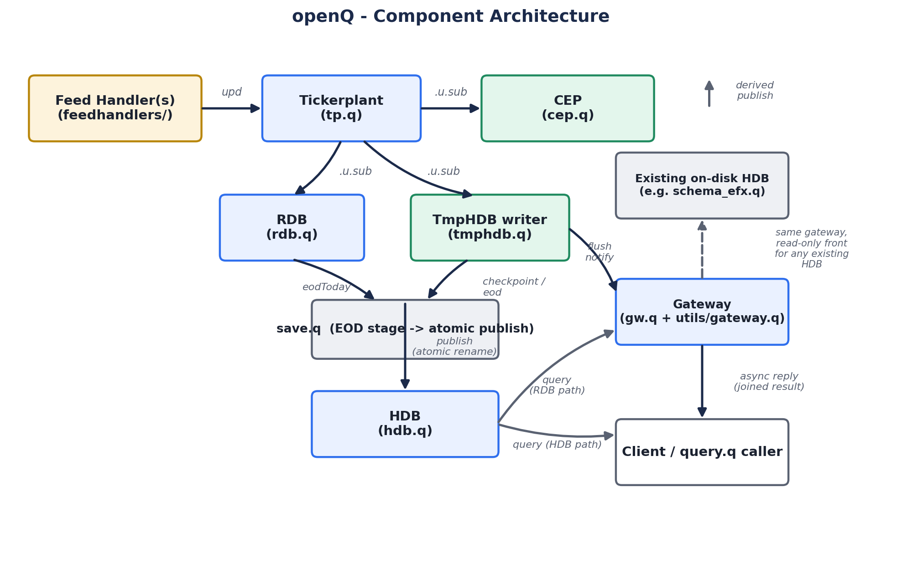
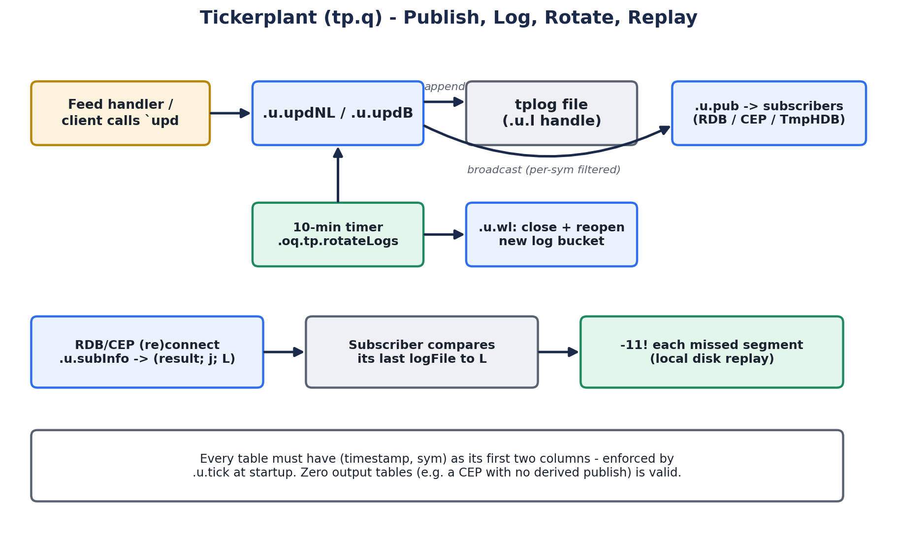
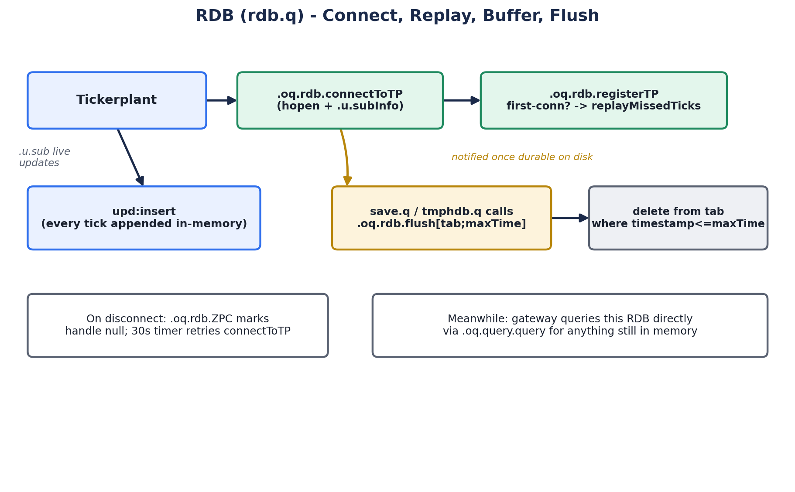
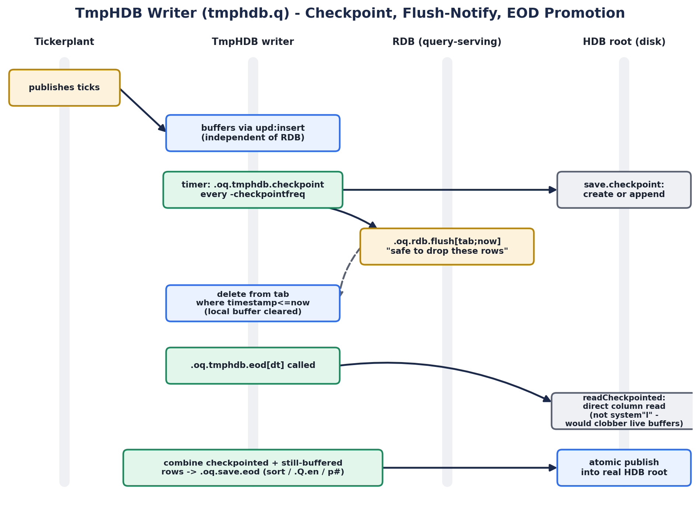
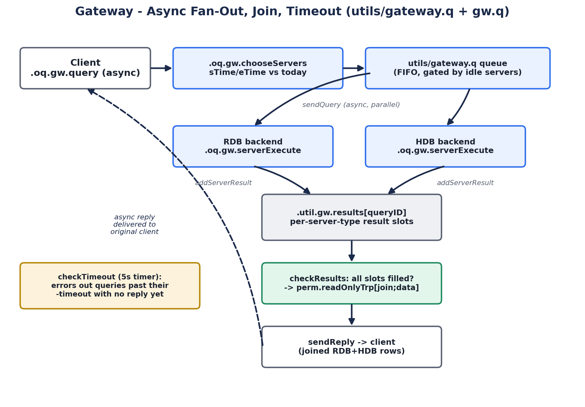
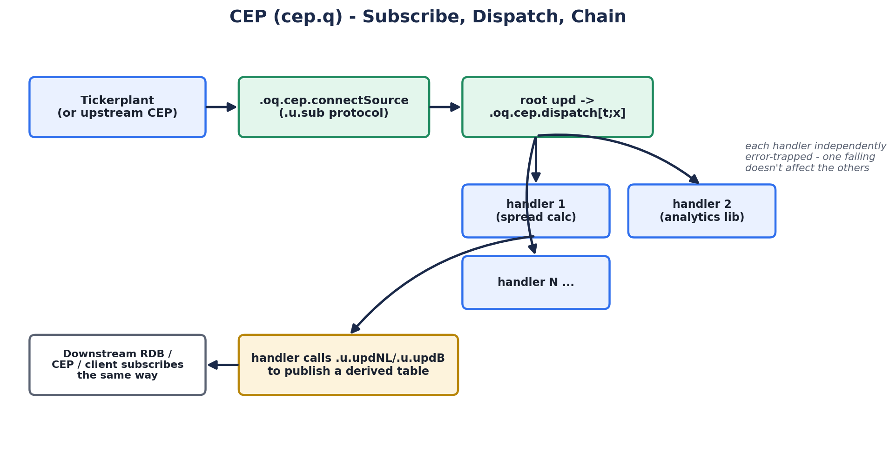
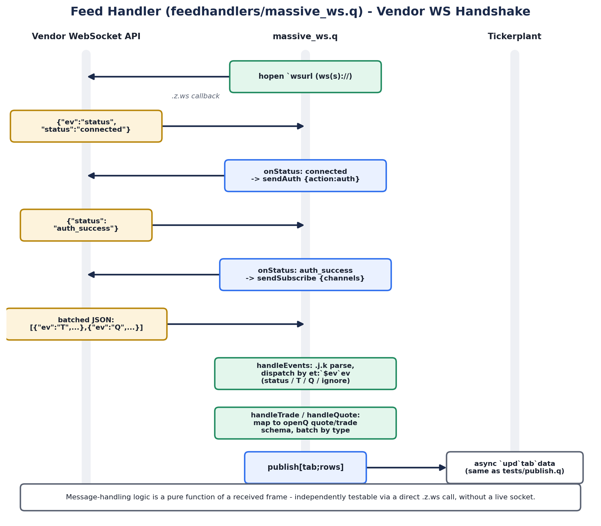

# openQ: a small, honest kdb+/q tick database

openQ is a from-scratch kdb+/q tick-database platform: a generic
tickerplant &rarr; RDB/HDB &rarr; gateway core, a CEP layer for real-time
analytics, and a handful of independent domain modules built on top of it
- spread cost attribution, trade markout and order impact, a securities-
lending/locate engine, a cross-module desk-risk report, and a pluggable
strategy-backtesting engine. Every architectural decision in it is one
you'd actually have to make running a real tick DB in production:
how a subscriber recovers after a disconnect, what happens to an RDB's
memory once an EOD writer has already checkpointed the same rows to disk,
how a query gets routed to the RDB, the HDB, or both without the caller
knowing which. Nothing here is a toy quote/trade demo dressed up - it's
the actual plumbing, built and tested against real (or realistically
shaped) data at every step.

This article walks through how it's put together: the core pipeline
first, then the config-driven module system built on top of it, then a
tour of what's actually running.

## The core pipeline

At its center, openQ is the same shape every kdb+ tick database is: a
tickerplant that's the single source of truth for what happened and when,
an RDB that serves today's data from memory, an HDB that serves history
from disk, and a gateway that hides the seam between them from whoever's
asking.



A feed handler (or several) publishes ticks into the tickerplant by
calling `` `upd `` - the standard tick.q convention. The tickerplant is the
only thing that ever writes the durable on-disk log; everything
downstream - the RDB, a CEP, an idb writer, another CEP subscribed to a
CEP - reaches it (or reaches something that ultimately reaches it) the
same way, via `.u.sub`. That single subscription protocol is what lets a
CEP sit anywhere in the chain: a CEP can consume from the tickerplant and
itself look exactly like a tickerplant to whatever subscribes to *it*,
which is how every module below layers its own analytics into the
pipeline without touching `core/` at all.

### Tickerplant: publish, log, rotate, replay



`core/tp.q` does four things: appends every incoming tick to an in-memory
log handle and to the on-disk tplog file, broadcasts it to subscribers
filtered to the tables/syms they actually asked for, rotates the log file
on a timer so it doesn't grow forever, and replays whatever a reconnecting
subscriber missed by comparing its own last-seen log position against the
tickerplant's current one. The one schema rule the tickerplant itself
enforces is that every table's first two columns are `timestamp,sym` -
everything downstream (RDB flush windows, HDB date-partitioning, the
gateway's time-range routing) assumes it.

### RDB: connect, replay, buffer, flush



The RDB subscribes to the tickerplant, buffers every tick in memory
exactly as it arrives, and serves it straight out of that in-memory table
for any query touching today. It doesn't decide on its own when to let go
of old rows - that's the idb writer's call (next section): once a
checkpoint is durably on disk, the idb writer tells the RDB it's safe to
drop everything up to that point, and the RDB deletes it from memory.
Disconnects are handled the unglamorous way every long-running kdb+
process handles them: a null handle gets marked on error, and a timer
keeps retrying the connection until it succeeds and replay catches the
RDB back up.

### idb writer: checkpoint, flush-notify, EOD promotion



This is the piece a lot of from-scratch tick-DB writeups skip. The idb
writer (`core/idb.q`) is a *second*, independent subscriber to the same
tickerplant - it buffers ticks completely separately from the RDB, and on
its own timer, checkpoints what it's buffered to disk and tells the RDB
"everything up to here is durable, you can drop it." That handshake is
the entire reason the RDB's memory doesn't grow unbounded across a
trading day. At end of day, `.oq.idb.eod` (or the standalone `core/eod.q`
role, for promoting a day after the fact with no live tp/rdb/idb running
at all) reads every checkpoint written so far straight off disk - not via
`system"l"`, which would clobber whatever's still buffered in the idb
writer's own memory - combines it with anything still unflushed, sorts
and enumerates it, and atomically publishes it into the real HDB root via
a rename. Every module in this repo actually runs *two* idb writers in
parallel against the same tickerplant (mirroring a redundant-writer
pattern from a real production system this was modeled on), so losing
one doesn't cost you durability.

### Gateway: fan out, join, time out



A client never queries the RDB or the HDB directly through the
gateway - it calls `.oq.gw.query` with a table, a time range, and a sym
filter, and the gateway decides which backend(s) actually need to answer.
An end time before today only needs the HDB; a start time from today only
needs the RDB; a range spanning the boundary needs both, queried in
parallel and joined once every slot comes back. Because the whole thing
is async (`neg[h]` fire-and-forget out, a matching reply back whenever
it's ready), a slow HDB scan never blocks the RDB's already-fast reply
from being collected, and a 5-second timeout timer error's out anything
that never comes back at all rather than hanging a client forever.

### CEP: subscribe, dispatch, chain



A CEP looks exactly like an RDB from the tickerplant's point of view
(same `.u.sub` subscription), but instead of just buffering rows for
query, it runs every handler registered against a table through
`.oq.cep.dispatch` - each one independently error-trapped, so one
handler's bug can't take down another's. This is the *only* piece of
`core/` a module is allowed to customize: every module's own domain logic
lives entirely in its `-cepscript`, registering handlers for whatever
tables it cares about. A handler is free to publish its own derived
output back out via `.u.upd`, which is what lets a CEP chain - an RDB, an
idb writer, another CEP, or a plain client can all subscribe to a CEP's
derived table the exact same way they'd subscribe to a real tickerplant.

### Feed handler: connect, parse, publish



`core/fh.q` is the generic role every feed handler shares: it connects
(and reconnects) to a tickerplant and loads a deployment-supplied
`-fhscript` for whatever's actually vendor-specific. The real example in
this repo, `modules/ingest/massive/fh.q`, talks to a Polygon-style forex
WebSocket API - connect, wait for `status:connected`, authenticate, wait
for `status:auth_success`, subscribe to channels, then handle a stream of
batched JSON events. The message-parsing/mapping/batching logic is
written as a pure function of an already-received text frame,
independent of the transport, specifically so it can be exercised in a
test without a live socket - which matters here, because the free/
unlicensed kdb+ build this was developed against doesn't actually have
WebSocket client support at all. The same logic runs unchanged on a build
that does.

## The module system

Every piece of domain logic in this repo - `mon`, `markout`, `spread`,
`primeFinance`, `massive`, `report`, `backtest` - is a
*module*: self-contained, built entirely on the config-driven bootstrap
above, and never touching or copying `core/`. `core/initFromCfg.q` reads
a JSON file (`cfg_proc/modules/<name>/tp.json`, `rdb.json`,
`idb.json`, ...) instead of a long CLI flag list, and
`scripts/startupAllByModule.sh <name>` starts whatever roles a module
actually defines, in the right order, from one command. A module's
*only* new code is what's genuinely custom to its domain - a schema file
and a `-cepscript` - because `tp.q`/`rdb.q`/`idb.q`/`hdb.q` are already
schema-agnostic:

```
schemas/schema_<name>.q         the module's own table shapes
cfg_proc/modules/<name>/*.json  one JSON per process role this module runs
modules/.../<name>/             the module's own cep.q / fh.q / simulator.q -
                                 grouped thematically under modules/analytics/,
                                 modules/ingest/, or modules/utils/
```

Each full pipeline module claims its own block of ports so any number of
them can run side by side without colliding:

| Module | What it does |
|---|---|
| `mon` | Central `logs`/`pidstats` tables - every process's own log messages plus host-level CPU/memory, both fed by their own real-time handlers |
| `markout` | Real trade/order/rate streams into `modules/analytics/markout/markOutImpact.q` - client deal markout and order/execution impact against a live rate feed |
| `spread` | Real quote streams into `modules/analytics/spread/spread.q` - quoted-spread build-up/attribution across seven named economic components |
| `primeFinance` | A stateful securities-lending engine: inventory &rarr; locate &rarr; reservation &rarr; borrow &rarr; position coverage &rarr; recall &rarr; buy-in, with a deterministic, weighted-scoring allocator |
| `massive` | A real vendor feed handler (WebSocket forex ticks/bars) feeding its own pipeline, shaped to match a genuine on-disk EFX historical archive |
| `report` | No pipeline of its own - a single process that, on a timer, recomputes a unified view across three other modules' data (see below) |
| `backtest` | No pipeline at all - a one-shot script that loads real historical bars and runs a pluggable strategy engine against them (see below) |
| `generator` | A schema-blind utility library that generates type-correct random data for *any* module's schema, for quickly exercising a pipeline end to end |

`eod` (`core/eod.q`, wired into every full-pipeline module) is the one
role deliberately left out of the always-on set: it's a one-shot batch
promotion job, run deliberately once a day's data is durably
checkpointed, not something that auto-starts.

## Desk Risk & TCA: three modules, one story

`spread`, `markout`, and `primeFinance` are each genuinely complete on
their own, but built independently they're three unrelated islands - no
shared symbols, no story connecting a name's trading cost to what
happens to it afterward or whether the resulting position can even be
financed. `modules/analytics/report/deskRisk.q` unifies their existing
pure batch functions - unmodified, no new logic added to any of the
three - into one per-symbol report: what it costs to trade a name
(spread), how the market moved against the desk afterward (markout/
impact), and whether the resulting short position can actually be
financed (primeFinance's coverage/borrow-fee data).
`modules/analytics/report/cep.q` is the only thing that
knows where each module's data actually lives - it merges each module's
still-live RDB rows with whatever's already durably checkpointed (so the
report's numbers don't flicker to nothing every time an idb writer
flushes), recomputes the report from scratch on a timer, and serves the
latest result for any client to query.

Every simulator in this trio publishes against the same shared symbol
universe, with one name deliberately given the worst economics across
every pillar - wide quoted spreads, volatile post-trade price moves, and
scarce, expensive-to-borrow inventory - so the unified report tells one
coherent story end to end, not three coincidentally bad numbers.

## Backtesting: a pluggable strategy pipeline

`modules/backtest/backtest.q` is a small, vectorized backtesting engine over
historical OHLC bars, modeled on QuantConnect's **LEAN** Algorithmic
Trading Engine's own Algorithm Framework. LEAN decomposes a trading
algorithm into four independently-swappable stages - alpha (signal),
portfolio construction (sizing), risk management (an overlay), and
execution (fill style) - each with a shipped default, so overriding one
stage never means touching the others. This engine adapts that same
decomposition to a batch context: LEAN's stages are event-driven objects
firing per tick against live/paper/backtest data, while this engine only
ever runs one call over a whole historical bars table at once, so each
stage here is a plain column-in/column-out q function instead.

`modules/backtest/run.q` demonstrates the pipeline against a real, large
on-disk EFX archive (1-minute FX bars, 2009-2026) - loaded read-only,
directly, with no live process needed at all. Writing your own strategy
means writing one function matching one of the four stage shapes and
handing it to the pipeline; the other three keep their defaults, or you
override those too, all from the command line with no code changes:

```
q modules/backtest/run.q -sym aud_cad -sDate 2020.01.15 -eDate 2020.01.15 \
  -strategy momentum -portfolio confweighted -risk maxdd -execution twap
```

## Tested the way it'd actually break

Every acceptance test in `tests/sh/` starts real processes - a
tickerplant, an RDB, a CEP, an idb writer - publishes real ticks, and
checks the *system's* behavior, not a mocked-out unit. `run_idb_test.sh`
brings up a full tp/rdb/idb trio on a 2-second checkpoint interval and
confirms a checkpoint actually flushes the RDB and an EOD promotion
actually produces a correctly sorted, attributed HDB partition.
`run_efx_test.sh` and `run_backtest_test.sh` both run against the real
EFX archive - not a synthetic fixture - and skip themselves cleanly
rather than fail on a machine that doesn't have it. `run_report_test.sh`
starts three full module pipelines, runs each one's simulator, and checks
that the unified report actually shows a deliberately-worse symbol coming
out worse on every single pillar. Nine suites in total, covering the core
pipeline, CEP handler chaining, the analytics libraries' real-time
ingest, idb checkpoint/EOD, the real historical archive integration, a
real vendor feed handler's message parsing, central log forwarding, the
cross-module desk-risk report, and the backtest engine.

## Where to look next

- `README.md` is the full reference - every role's CLI params, the
  config-driven bootstrap, the complete module ports table, and the
  "Integrating an existing HDB" and "Monitoring & logging" stories that
  didn't fit here.
- `core/` is worth reading in the order this article walked it:
  `tp.q` &rarr; `rdb.q` &rarr; `idb.q` &rarr; `hdb.q` &rarr; `gw.q` &rarr;
  `cep.q`.
- `modules/analytics/` and `modules/backtest/` are where the actual
  quant logic lives, independent of any pipeline - `spread.q`,
  `markOutImpact.q`, `primeFinance.q`, `deskRisk.q`, `backtest.q`,
  `candle.q` - each loadable and testable with no CEP or IPC at all.
- `tests/sh/` is the fastest way to see any of this actually run.
